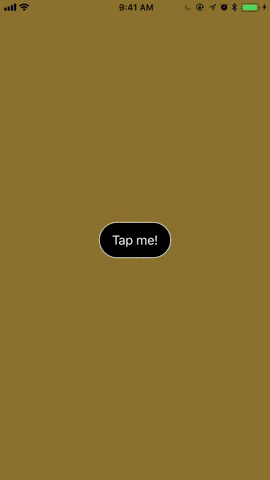

# DTContainerController

[](https://travis-ci.org/tungvoduc/DTContainerController)
[](http://cocoapods.org/pods/DTContainerController)
[](http://cocoapods.org/pods/DTContainerController)
[](http://cocoapods.org/pods/DTContainerController)

DTContainerController is a view controller container written in Swift.

## Why DTContainerController?

There are cases where you want to present a new view controller and destroy the current view controller. The most applicable cases are when user goes through onboarding phase and logs into the app or when user logs out from the app to log-in view. In these cases, the new view controller are presented and there is no reasons to keep old view controller alive,  this cannot be done by using present(_:animated:completion:) since the presenting view controller still exists after presentation. This is why DTContainerController becomes handy.

DTContainerController should usually be used as the root view controller of the application window.

## Screenshot


## Usage

DTContainerController has at most one child view controller. In order to set the child view controller or replace the current child view controller with animation, you can use:

```swift
// Set or replace current view controller without animation
containerController.show(childViewController, animated: false, completion: nil)

// Present a new child view controller and destroy current child view controller with transition
containerController.show(childViewController, animated: true, completion: nil)
```

Accessing container controller ancestor is similar to navigationController or tabbarController:

```swift
// Access parent container controller and present a new view controller
self.containerViewController?.show(childViewController, animated: true, completion: nil)
```

## Example

To run the example project, clone the repo, and run `pod install` from the Example directory first.

## Requirements
#### iOS 8.3+

## Installation

DTContainerController is available through [CocoaPods](http://cocoapods.org). To install
it, simply add the following line to your Podfile:

```ruby
pod 'DTContainerController'
```

## Author

Tung Vo, tung98.dn@gmail.com

## License

DTContainerController is available under the MIT license. See the LICENSE file for more info.
